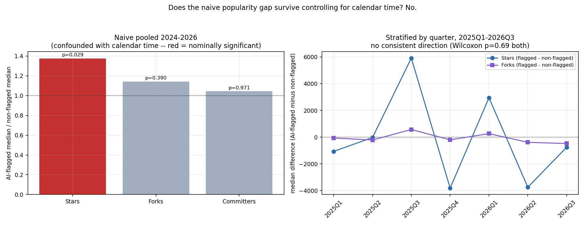
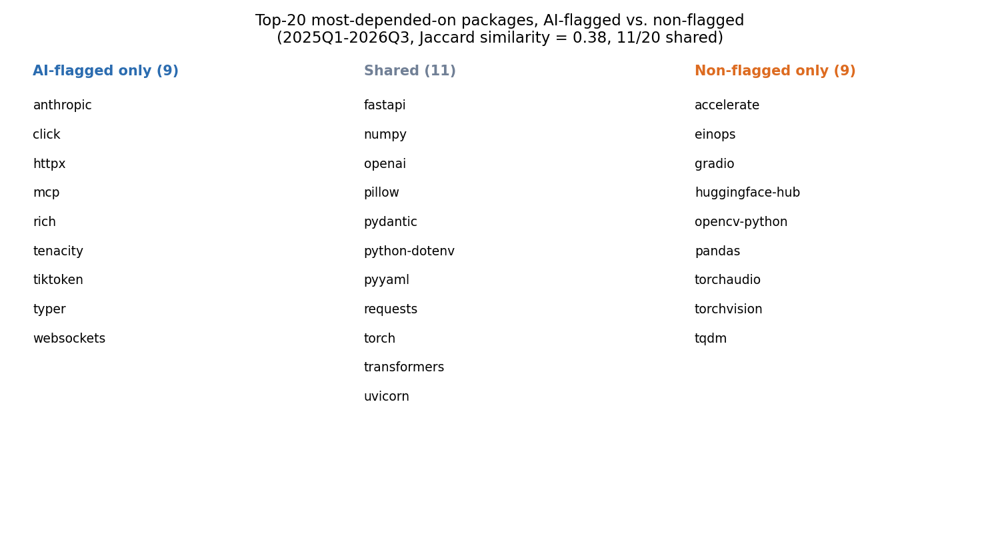

# Do AI-authored packages build dependency networks differently?

**Hypothesis under test:** the dependency network of fresh, AI-usage-proven
packages is evolving in a different way than otherwise-comparable
non-AI-flagged ones. Answer, up front: **the part of this that looked
true doesn't survive a basic confound check, and the part that's real
isn't what the hypothesis predicted.** AI-flagged packages do not depend
on more-popular or more-concentrated packages than non-flagged ones once
calendar time is controlled for — but they do depend on visibly
*different specific packages*, reflecting what kind of software gets
built with AI assistance right now more than how AI assistance changes
dependency choice in general.

This report is a direct extension of [DEPENDENCY_REPORT.md](DEPENDENCY_REPORT.md)
and [AI_USAGE_REPORT.md](AI_USAGE_REPORT.md), triggered by a session
spent understanding an external academic project,
[cl_ecosystem_networks](#connection-to-cl_ecosystem_networks) (npm/PyPI/CRAN
dependency-network growth at multi-million-node scale), whose own authors
flag exactly this question — "decompose the post-2022 densification
effect by actual AI involvement" — as unfinished future work they have no
package-level ground truth to attempt. This project's `AI_USAGE_REPORT.md`
has exactly that ground truth, at a much smaller scale; this report is
the first attempt to point it at that question.

## Method

Reuses `output/deps/edges.csv` (14,832 newborn-package → dependency
edges) joined against `output/ai_signal/ai_signals.csv`'s `has_signal`
flag (the same self-disclosed commit-trailer / config-file evidence from
AI_USAGE_REPORT.md — a floor on true AI-tool usage, not an estimate of
it; see that report for the full caveat). Restricted throughout to
packages born **2024 or later**: self-disclosed AI usage is ~0% before
2024, so including 2014–2023 would just reproduce the calendar-time
trend already documented in DEPENDENCY_REPORT.md's time-dimension
section, not test anything about AI specifically.

**A confound had to be caught and handled before anything else.** Within
2024–2026, "AI-flagged" and "later quarter" are nearly the same variable:
2024Q1 has 0 of 30 packages flagged; 2026Q1 has 25 of 30. A pooled
comparison across the whole window would mostly measure the already-known
rising-popularity-over-time trend, not an AI effect. Two views are
reported for exactly this reason:

1. **Naive pooled 2024–2026** — shown for transparency, explicitly
   labeled confounded, not trusted as an answer on its own.
2. **Stratified by quarter, 2025Q1–2026Q3** (the 7 quarters with a
   usable number of packages in *both* groups — ≥3 packages/group):
   compute the AI-flagged-vs-non-flagged difference *within* each
   quarter separately, then test whether the direction is consistent
   across quarters with a Wilcoxon signed-rank test on the paired
   per-quarter differences. This is the deconfounded test.

296 packages fall in the 2024–2026 window (139 flagged, 191 non-flagged),
yielding 6,064 edges.

## The naive result looks real. It isn't.

Pooled across 2024–2026, AI-flagged packages' dependencies have a higher
median star count (7,848 vs. 5,706, a 1.38× ratio) with a nominally
significant Mann-Whitney p = 0.029. Read on its own, that's exactly what
the hypothesis predicts and exactly the kind of number that's tempting to
report as the finding.

**It's a time-confound artifact.** Stratified by quarter, the Wilcoxon
signed-rank test on the paired differences gives p = 0.69 for stars and
p = 0.69 for forks (p = 0.41 for lifetime contributors) — nowhere close
to significant. More tellingly, the *direction* isn't even consistent:
AI-flagged packages have **lower** median star dependencies in 5 of the 7
stratified quarters, not higher (2025Q1: −1,067; 2025Q2: −27; 2025Q4:
−3,810; 2026Q2: −3,747; 2026Q3: −756 — only 2025Q3 and 2026Q1 go the
other way, and by large margins that don't repeat). The naive pooled
"effect" was almost entirely 2024's near-zero flagged sample and 2026's
near-total flagged sample producing a spurious calendar-time correlation,
not a real AI-vs-non-AI difference. **Once deconfounded, there is no
evidence that AI-flagged packages depend on more, less, or differently
positioned popularity than comparable non-flagged packages.**

## Dependency breadth: no robust difference either

Naive comparison suggested AI-flagged packages declare noticeably fewer
dependencies (median 10 vs. 13 for non-flagged). Restricted to the
same stratified 2025Q1–2026Q3 window, that gap nearly vanishes (10 vs.
9.5) — another naive signal that mostly reflects calendar time, not an
AI effect. One difference that *is* stable across both views: AI-flagged
packages show a higher rate of zero extractable dependencies (12.5–13.0%
vs. 8.4–9.8%). This could be a real effect (self-contained scaffolding
AI tools tend to generate) or a measurement artifact — this project's
dependency parser only reads literal `install_requires` lists,
`pyproject.toml` tables, and `requirements.txt` (see DEPENDENCY_REPORT.md's
method section); if AI-generated manifests favor a declaration pattern
this parser doesn't handle, that would show up as a false zero. Not
resolved here.

## What's actually different: which packages, not how many or how popular

Comparing the 20 most-depended-on packages in each group (stratified
window), the overlap is moderate — Jaccard similarity 0.38, 11 of 20
shared — but the *non-overlapping* halves tell a clear, coherent story.
**AI-flagged-only**: `anthropic`, `mcp` (the Model Context Protocol),
`tiktoken`, plus `click`, `typer`, `rich`, `httpx`, `websockets`,
`tenacity` — an LLM-agent-and-API-client-tooling cluster: the SDKs and
CLI/networking scaffolding you'd reach for building an AI agent or
wrapping an API. **Non-flagged-only**: `accelerate`, `einops`, `gradio`,
`huggingface-hub`, `opencv-python`, `pandas`, `torchaudio`,
`torchvision` — a classic ML-research-and-computer-vision cluster: the
PyTorch/HuggingFace ecosystem for training and evaluating models. The
shared middle ground (`numpy`, `torch`, `transformers`, `fastapi`,
`pydantic`, `requests`, `uvicorn`, `openai`) is the common infrastructure
both kinds of project need regardless of how they were written.

**This is a compositional difference, not a structural one, and the
distinction matters for how to read the whole report.** The original
hypothesis was framed as the dependency *network* evolving differently —
implying something about graph shape, concentration, or growth dynamics.
What this data actually shows is that AI-flagged and non-flagged
packages tend to be **different kinds of software** (agent/API tooling
vs. ML/CV research tooling), each pulling in the ecosystem-standard
dependencies for its own kind — not that AI authorship changes how a
comparable piece of software picks its dependencies. That's a real,
interesting finding, but it's a different claim than the one under test,
and this report is explicit about not overstating it as confirmation of
the original hypothesis.

**A specific, unresolved confound worth naming directly**: a package
being AI-flagged and a package being LLM/agent-topic software are
plausibly the same underlying thing wearing two hats — someone building
an agent framework today is more likely to reach for Claude Code *and*
more likely to import `anthropic`/`mcp`. This report cannot separate "AI
tools cause agent-flavored dependency choices" from "people building
agent-flavored software right now also happen to be the people using AI
coding tools right now" — both produce the same observed pattern, and
untangling them would need a control group of AI-flagged non-agent
software, which this sample doesn't have enough of.

## Connection to cl_ecosystem_networks

`cl_ecosystem_networks` (a separate academic project, local at
`~/Documents_alt/Research/cl_ecosystem_networks/`, not part of this
project and explored read-only) studies npm/PyPI/CRAN dependency-network
growth from
2000–2026 using ecosyste.ms's full bulk data release — multiple orders
of magnitude larger than this project's sample, with three formal
generative network models fitted against an empirical **densification**
finding (edge count growing faster than node count). Their own pipeline
already ran a structural-break test for the ChatGPT release date on the
whole-ecosystem densification curve (Chow test, `ai_breakpoint_analysis.py`):
npm shows a large but fragile break (p = 0.0001 at that specific date,
but not independently found by an unconstrained break search), PyPI
shows a clean null, CRAN's result contradicts its own decelerating
release cadence. Their own written synthesis names, as unattempted future
work, exactly this report's question — separating packages with genuine
AI involvement from the rest of the post-2022 aggregate signal — because
they have no package-level ground truth for which packages that is.

This report is a first, small-scale attempt at that decomposition, and
the honest result is a null on the structural/popularity axis their
model-fitting apparatus would care about most, plus a real compositional
signal their aggregate curves can't see at all. Two things worth stating
plainly about scale: this project's 139 AI-flagged packages are two to
three orders of magnitude smaller than what their sup-F/Chow/copying-model
machinery was built and validated on — not enough to refit their formal
models or rerun a proper break search on an AI-flagged sub-network — and
this project's single-snapshot-per-package design has no longitudinal
per-package edge history, which their data does. A genuine next step
(unattempted here) would use their full population of newborn PyPI
packages by quarter — removing this project's GitHub-star sampling bias
entirely — as the base population for this project's AI-signal scan,
which is the point where each project's respective weak spot gets fixed
by the other's data.

## Caveats

- **Confound discipline applies to every number in this report, not just
  the headline one** — see the naive-vs-stratified sections above for
  why every comparison here is shown both ways.
- **`has_signal` is the same floor-not-estimate measure from
  AI_USAGE_REPORT.md.** False negatives (real AI usage with no visible
  trace) are expected to be common; this report inherits that limitation
  fully.
- **The stratified test has real power limits of its own** — 7 quarters,
  with per-quarter group sizes as low as 3–8 packages. A null result here
  is evidence of no *large, consistent* effect, not proof of exactly
  zero effect.
- **The agent-vs-ML-research compositional split is read from a top-20
  list, not tested statistically.** A formal topic-classification pass
  would be needed to confirm it holds beyond the specific packages named
  here.

## Data & reproducing this

- Naive and stratified comparison tables: `output/deps/analysis_ai_comparison/*.csv`
- Top-20 overlap detail: `output/deps/analysis_ai_comparison/top20_overlap.json`
- Charts: `output/deps/charts_ai_comparison/`
- Regenerate: `python3 src/ai_dependency_comparison.py && python3
  src/ai_dependency_comparison_charts.py` (requires `output/deps/edges.csv`,
  `output/deps/dependency_popularity.csv`, and `output/ai_signal/ai_signals.csv`
  from the earlier studies)
