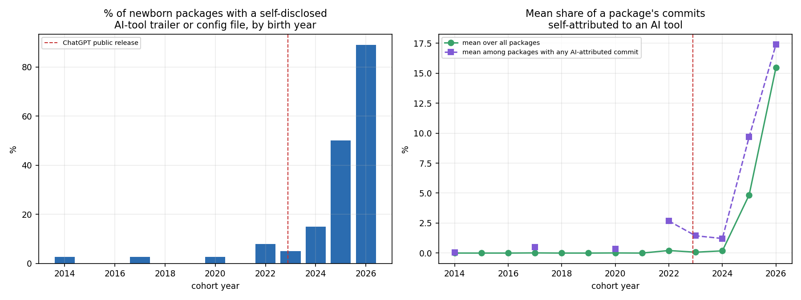
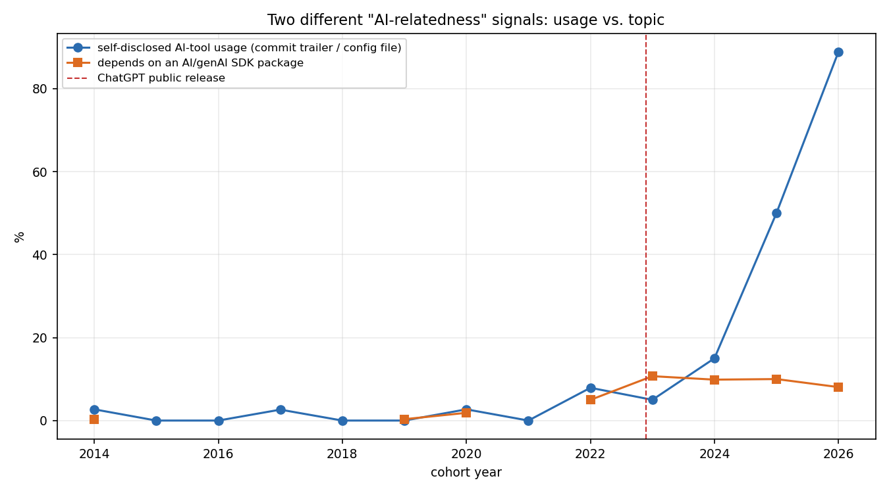
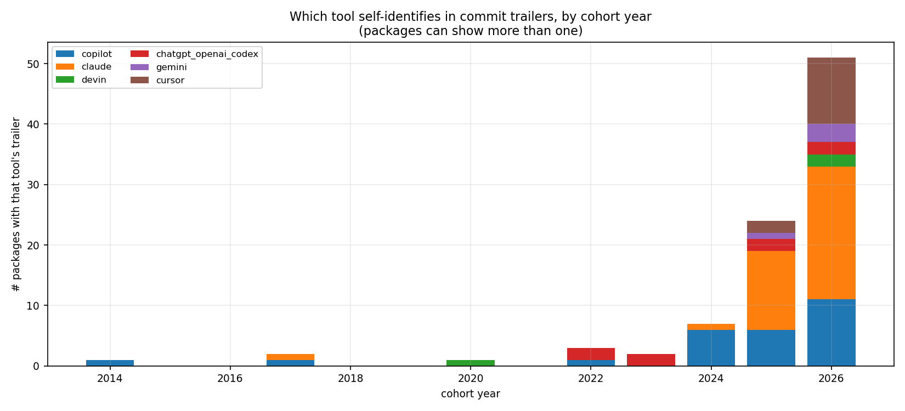

# Is AI actually writing these packages, not just being depended on?

[DEPENDENCY_REPORT.md](DEPENDENCY_REPORT.md) measured whether newborn
packages depend on AI/genAI SDKs (`openai`, `transformers`, ...) — a
*topic* signal, what a package is about. This report measures something
different: direct, retrospective evidence that a package's own code was
**written with an AI coding tool**, read straight out of its git history.
Same 490 vintage-cohort packages, a completely different signal.

**Headline: self-disclosed AI-tool usage went from ~0% of newborn
packages through 2021 to 89% of the (partial) 2026 cohort, and by
2025–2026 it has overtaken AI-topic SDK dependence as the dominant
"AI-relatedness" signal in this sample — recent packages are more likely
to be *written by* an AI tool than to merely *depend on* one.**

## Method

Two signal types, both read from git objects already reachable via each
package's `clone_url` + `snapshot_sha` in `output/vintage/packages.csv`
(same `--no-checkout` clone discipline as everywhere else in this
project):

1. **Commit trailers that self-identify a tool** — the same
   `Co-Authored-By: Claude` convention visible in this very project's own
   commit history. Scanned across a package's *entire* history up to its
   snapshot commit (not just a window), matched against explicit
   co-authorship/generation patterns for Claude, GitHub Copilot, Cursor,
   ChatGPT/OpenAI Codex, Devin, Gemini, Amazon Q, Windsurf, Replit, and
   Aider.
2. **Config/instruction files a repo carries for a tool to read** —
   `CLAUDE.md`, `.cursorrules`, `.github/copilot-instructions.md`,
   `AGENTS.md`, `.windsurfrules`, and the `.claude/`, `.cursor/`,
   `.continue/`, `.windsurf/` directories — checked for presence at the
   snapshot commit.

Deliberately **strong-signal, low-recall**: matching only explicit
co-authorship trailers (not bare mentions of a tool's name) means a
positive here is solid evidence — nobody accidentally writes
`Co-Authored-By: Claude` — but a negative proves nothing. Most
AI-assisted commits (autocomplete completions, chat-suggested code pasted
in by hand, anything committed under a human's own identity) leave no
trace at all. **This measures self-disclosed usage, not true usage, and
it is a floor, not an estimate of the real rate.**

## Adoption: near-zero through 2021, then a sharp, sustained rise

| cohort year | packages | % with any AI-tool signal | mean commit-share attributed to AI (all packages) |
|---|---:|---:|---:|
| 2014–2021 | 285 | 0–2.7% (noise) | ~0% |
| 2022 | 38 | 7.9% | 0.2% |
| 2023 | 40 | 5.0% | 0.1% |
| 2024 | 40 | 15.0% | 0.2% |
| 2025 | 40 | **50.0%** | 4.8% |
| 2026 (Q1–Q3, partial) | 27 | **88.9%** | 15.2% |

Trend is strong and significant: Spearman ρ=0.75, p=0.003 for adoption
rate; ρ=0.76, p=0.003 for mean AI-attributed commit share. 2026 is a
partial year (through the extraction date) on a smaller sample (27
packages, vs. ~40 for a full year) — the rate should be read as "the most
recent few months look even more extreme than 2025," not taken as a
precise annual figure.

## This overtook AI-SDK topic dependence around 2024–2025

Through 2022–2024, self-disclosed AI-tool usage and AI-SDK dependency
share moved roughly together (both in the 5–15% range) — consistent with
"AI-relatedness" mostly meaning packages *about* AI. From 2025 onward
they diverge sharply: AI-SDK dependency share plateaus around 8–10%,
while self-disclosed tool usage keeps climbing to 50% then 89%. **By
2025–2026, most of the AI signal in this sample is about *how* a package
was written, not *what* it does.** A package no longer needs to be an AI
application for AI to plausibly have written parts of it.

## Not just a self-referential niche

Repos with "claude," "copilot," "cursor," "skill," or "agent" in their
own name (Claude-skill libraries, agent-tooling meta-packages) are 13 of
the 58 packages showing any AI signal (22%) — a real presence, but a
minority. Restricting to the other 45 (packages with no such
self-referential name — a stock-analysis tool, a video-editing toolkit, a
browser-automation harness, several of Andrej Karpathy's ML research
repos, and others with no obvious connection to AI *tooling* as a topic)
the same rising pattern holds: 1 in 2014, 1 in 2017, 1 in 2020, 3 in 2022,
2 in 2023, 6 in 2024, **13 in 2025, 18 in 2026** (partial year). This is
broad-based, not an artifact of a self-referential AI-tooling category
inflating the numbers.

## Which tool shows up — read this one with real caution

Claude dominates the trailer counts from 2024 onward (1 in 2024, 13 in
2025, 22 in 2026), ahead of Copilot (6, 6, 11) and Cursor (0, 2, 11).
**This is not a reliable read of which tool is used most — it's at least
as much a read of which tool discloses itself most consistently by
default.** Claude Code (this very project's own tool) adds a
`Co-Authored-By: Claude` trailer to every commit unless a user
disables it; GitHub Copilot's inline autocomplete, by contrast, is
attributed to nothing by default — a developer accepting Copilot
suggestions inside their own commits is invisible to this method
entirely. **Copilot in particular is almost certainly undercounted here
far more than Claude or Cursor are**, simply because its most common mode
of use leaves no marker to find. Read the adoption-rate trend (a tool was
used) as the reliable finding; read the tool-breakdown chart (which tool)
as biased toward whichever tools happen to self-disclose by convention,
not as a market-share estimate.

## The extreme cases

Some 2025–2026 packages are majority AI-attributed by commit count:
`Imbad0202/academic-research-skills` (70.6%, 525/744 commits),
`yusufkaraaslan/Skill_Seekers` (61.4%), `Graphify-Labs/graphify` (51.3%,
861/1,678 commits). The last is worth flagging on its own: it's the same
repo noted in the vintage-cohort study as showing star counts implausible
for a repo only months old (115,989 stars) — a heavily-AI-agent-driven
project, a bot-inflated one, or both; either reading is consistent with
an unusually high self-disclosed AI-commit share. Full table:
`output/ai_signal/analysis/top15_ai_attributed.csv`.

## Caveats

- **Floor, not an estimate.** Every number in this report is a lower
  bound on true AI-tool usage. The true rate is unknowable from git
  history alone for tools that don't self-disclose.
- **Disclosure convention, not usage frequency, drives the tool
  ranking** — see above. Don't read "Claude appears most" as "Claude is
  used most."
- **This still can't attribute *why*.** It shows a rising, broad-based,
  statistically strong trend in self-disclosed AI-tool usage among
  newborn packages — consistent with the "recency" component of the
  broader popularity-effect hypothesis in DEPENDENCY_REPORT.md's
  time-dimension section, but that report's *concentration* finding
  (packages converging on the same popular dependencies) did **not**
  hold up once corrected for sample size. Rising AI-tool usage and flat
  dependency concentration can both be true at once — this report
  doesn't reconcile them further; a real answer would need to check
  whether AI-tool-flagged packages specifically show different
  dependency-concentration behavior than non-flagged ones in the same
  cohort, which isn't done here.
- **2026 is a partial year** on a smaller sample (27 vs. ~40 packages) —
  treat the 88.9% figure as directional, not a stable annual rate.

## Data & reproducing this

- Per-package signals: `output/ai_signal/ai_signals.csv`
- Cohort adoption rates, tool breakdown, trend tests, top-attributed
  packages: `output/ai_signal/analysis/*.csv`
- Regenerate: `python3 src/ai_signal_extract.py && python3
  src/ai_signal_analysis.py && python3 src/ai_signal_charts.py`
  (requires `output/vintage/packages.csv` from the vintage-cohort study
  and `output/deps/analysis_time/` from the dependency time-analysis)
