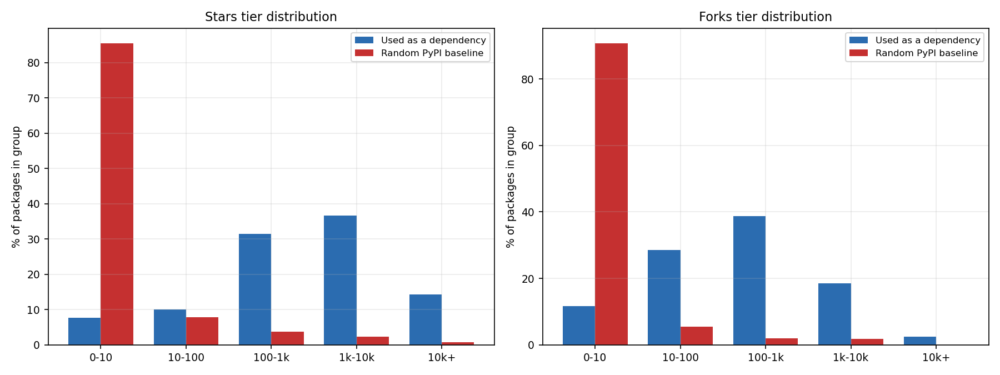
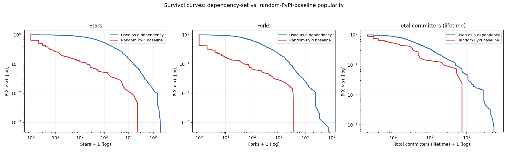
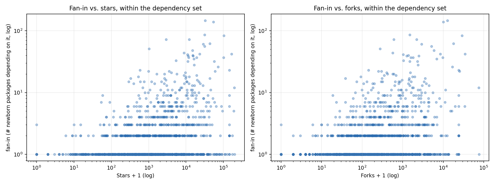

# Are popular packages more likely to end up in a newborn package's dependency list?

**Hypothesis under test:** a package with more stars, forks, or contributors
is highly probably in the dependency list of a newly-created package.
Answer, up front: **yes, decisively for stars and forks, more modestly for
contributor count** — and the effect is not just "of course famous
packages get used," it holds up against a genuine random-package baseline,
not just against intuition.

## Method

Reuses the 490 packages from the [vintage-cohort study](VINTAGE_REPORT.md) as
"newborn packages": for each one, its declared dependencies were parsed
directly from the manifest at the exact same git snapshot already used to
measure its code structure (`pyproject.toml`'s `[project.dependencies]` /
`[tool.poetry.dependencies]`, `setup.py`'s `install_requires` — including
the common pattern where it's a module-level variable referenced by name,
not just an inline list — and root `requirements.txt`). This is a
**case-control design, not a description**: "the dependencies people
actually use are popular" is nearly tautological on its own (of course
`requests` and `numpy` show up) — the real test is whether the *set* of
packages that get used as a dependency is drawn from a more popular slice
of the ecosystem than a package chosen at random would be. That needs a
baseline, so alongside the dependency set this pulls a random sample of
400 PyPI packages (sampled popularity-blind, from ecosyste.ms's default
package ordering rather than any downloads/stars sort) to compare against.

Popularity metrics (stars, forks, lifetime contributor count) come from
[ecosyste.ms](https://ecosyste.ms), which mirrors GitHub repo metadata
per PyPI package in a single API call — no GitHub API involved, so none
of the unauthenticated-rate-limit constraints from the vintage study
applied here (ecosyste.ms's own limit is 5,000 requests/window).
"Contributors" = `repo_metadata.commit_stats.total_committers`, a lifetime
count of everyone who ever committed, not a recent/active-contributor
count.

**Coverage:** 373 of 490 newborn packages (76%) had at least one
extractable dependency (117 had none — some legitimately ship with zero
external dependencies this early, some declare dependencies dynamically
in a way that can't be read without executing `setup.py`, which this
deliberately never does). That yielded 5,231 (newborn → dependency) edges
across 1,609 unique dependency names, of which 1,605 (99.8%) resolved to
a real PyPI package on ecosyste.ms. All 400 baseline packages resolved.

## Result: the dependency set is a massively more popular slice of PyPI than chance

| metric | dependency-set median | baseline median | ratio | Mann-Whitney p | P(random dependency > random baseline) |
|---|---:|---:|---:|---:|---:|
| stars | 1,191 | 2 | **596×** | 1.4×10⁻⁹⁵ | 93.2% |
| forks | 196 | 0 | — (baseline median is 0) | 2.3×10⁻⁹¹ | 92.2% |
| lifetime contributors | 47 | 13 | 3.6× | 5.9×10⁻⁶ | 70.1% |

The last column is the common-language effect size: pick one package used
as a dependency and one random baseline package — that's the probability
the dependency one has the higher value. For stars and forks that's over
90%, about as clean a separation as this kind of ecosystem data ever
produces. **85.5% of a typical random PyPI package has 10 stars or
fewer** — that's the modal case for "a package on PyPI," not an edge case
— while only 7.7% of used-dependencies fall in that bin; 14.2% of
dependencies have 10,000+ stars against 0.75% of random packages.

Contributors is the same direction but visibly weaker — 70% is a real,
statistically solid effect (p = 5.9×10⁻⁶), not noise, but nowhere near the
stars/forks separation. A plausible reading: stars and forks are largely
driven by *visibility* (how many people have seen and reacted to the
repo), which is exactly the kind of signal that would drive independent
package authors toward a dependency in the first place — whereas
lifetime-contributor-count also reflects how long a project has existed
and how many people happened to submit even a single patch, which is a
noisier proxy for "would a newcomer pick this."

## Being popular is close to necessary for wide adoption, but not sufficient

Restricting to only the packages that *are* used as a dependency, does
being used by *more* of the 490 newborns (higher "fan-in") track with
being *more* popular? Yes, but only moderately: Spearman ρ = 0.32 for
stars, 0.31 for forks, 0.27 for contributors (all p < 10⁻²², so the
relationship is certainly real, just not tight). The scatter plot shows
why: packages used by only 1 of the 490 newborns span the *entire* star
range, from single digits to 100,000+ — a highly-starred package can
still be a niche dependency picked up by just one or two of this specific
sample. But high fan-in (10+ newborns depending on it) essentially never
happens below a few hundred stars. Read together: **popularity looks
close to a necessary condition for broad adoption as a dependency, but it
is not sufficient** — a package also has to be generically useful across
many different projects' domains, which star count alone doesn't capture.

## The 20 most-depended-on packages in this sample

| package | used by (of 490) | stars | forks | lifetime contributors |
|---|---:|---:|---:|---:|
| numpy | 146 | 32,629 | 12,691 | 1,838 |
| requests | 139 | 54,279 | 10,119 | 742 |
| tqdm | 86 | 31,300 | 1,489 | 120 |
| torch | 83 | 102,657 | 29,031 | 5,024 |
| pyyaml | 72 | 2,941 | 601 | 42 |
| pillow | 72 | 12,226 | 2,226 | 491 |
| pandas | 62 | 43,640 | 17,915 | 3,550 |
| pydantic | 61 | 28,734 | 2,931 | 597 |
| openai | 56 | 31,557 | 5,173 | 115 |
| six | 51 | 1,028 | 276 | 67 |
| scipy | 48 | 14,990 | 5,909 | 1,667 |
| python-dotenv | 44 | 8,868 | 571 | 102 |
| matplotlib | 42 | 23,145 | 8,468 | 1,730 |
| transformers | 42 | 164,705 | 34,419 | 2,816 |
| uvicorn | 41 | 10,939 | 1,022 | 198 |
| click | 40 | 15,104 | 1,381 | 373 |
| httpx | 39 | 15,459 | 1,270 | 241 |
| pytest | 39 | 11,329 | 2,494 | 977 |
| tiktoken | 37 | 19,120 | 1,604 | 19 |
| jinja2 | 37 | 11,766 | 1,820 | 310 |

Full table: `output/deps/analysis/top20_most_depended_on.csv`. Note
`pyyaml` and `six` sit near the bottom of this list's star counts (2,941
and 1,028) yet rank in the top 10 by fan-in — both are exactly the
"generically useful, low-glamour utility" case the fan-in-vs-popularity
finding above predicts: broadly adopted despite modest visibility,
because nearly every project needs them.

## Caveats

- **This sample is itself star-ranked at the source.** The 490 newborn
  packages were discovered by GitHub search sorted by stars (see the
  vintage study). A newborn package that's already popular may be more
  likely to declare fashionable, also-popular dependencies (a
  correlated-adoption effect) rather than every dependency choice being
  independent evidence. This report doesn't attempt to separate "popular
  packages get chosen because they're popular" from "popular newborn
  packages and popular dependencies both reflect the same underlying
  trendiness" — both are consistent with the data here.
- **`total_committers` is a lifetime count**, not weighted by recency —
  an old, large, but now-quiet project can out-rank an actively-growing
  one on this metric alone.
- **The AI/LLM tooling skew in the top-20 list** (`openai`, `transformers`,
  `tiktoken`) reflects when these 490 packages were sampled and searched
  for (2014–2026, weighted toward however GitHub's own growth distributes
  across that window — see the vintage study's caveat on this) more than
  it reflects the general PyPI ecosystem.
- **The baseline is popularity-blind, not usage-blind** — it's a random
  sample of *published* PyPI packages, which already excludes every
  never-published private/internal package. The true "any package that
  could theoretically be a dependency" universe is unmeasurable; this
  baseline is the closest practical proxy.

## Data & reproducing this

- Dependency edges (newborn → dependency): `output/deps/edges.csv`
- Per-newborn manifest summary (sources used, dependency count):
  `output/deps/newborn_manifest_summary.csv`
- Resolved popularity for every dependency: `output/deps/dependency_popularity.csv`
- Random baseline sample: `output/deps/baseline_popularity.csv`
- Case-control test, fan-in correlation, tier breakdowns, top-20 table:
  `output/deps/analysis/*.csv`
- Regenerate: `python3 src/deps_extract.py && python3 src/deps_popularity.py
  && python3 src/deps_analysis.py && python3 src/deps_charts.py`
