# How has Python source code changed since 2014?

Ten mature, actively-maintained Python projects, two independent measurement
panels, four metric families, 2014Q1&ndash;2026Q2 (2026Q3 excluded everywhere
below as the partial trailing quarter). Methodology, the file filter, and
every extraction caveat are in [README.md](README.md); this document is the
findings.

**Sample:**

| repo | HEAD (short) | Panel A rows | Panel B quarters | clone size |
|---|---|---:|---:|---:|
| pandas | `04dff44f6224` | 23,579 | 51 | 451 MB |
| numpy | `d9079517ca17` | 11,250 | 51 | 212 MB |
| scipy | `f389d8d3514b` | 16,711 | 51 | 228 MB |
| scikit-learn | `2cc7893a2097` | 12,833 | 51 | 211 MB |
| matplotlib | `8a621d3bbebb` | 21,342 | 51 | 532 MB |
| django | `fc4eaaabf419` | 12,711 | 51 | 321 MB |
| sqlalchemy | `121d0cde4679` | 5,628 | 51 | 126 MB |
| sympy | `3cbbd286f761` | 30,644 | 51 | 216 MB |
| ipython | `e18b391ad00d` | 6,906 | 51 | 91 MB |
| pytest | `3fd8675d6d79` | 5,988 | 51 | 48 MB |

Full HEAD SHAs, extraction timestamps, and clone/run timings are in
`output/<repo>_meta.json`. `parse_rate` is reported per repo-quarter in
`output/<repo>_panel_b.csv`; every repo reaches 1.00 well before 2020 (pandas
and scikit-learn take until ~2017 to clear legacy Python-2-only syntax in a
few files — see README for the specific example verified during validation).

---

## Family 1 — comment length

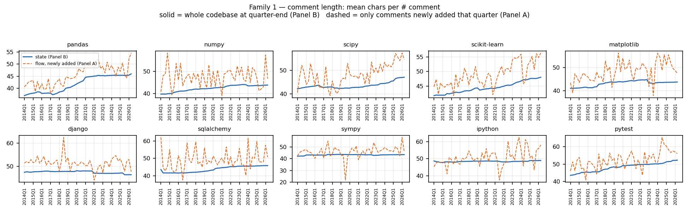

Both panels move the same direction — comment length has grown steadily,
not suddenly — but disagree on how much, which is the point of running two
panels: **state** (mean length of every `#` comment in the codebase at
quarter-end, Panel B) rose a fixed-effects-pooled **+9.0%** over the window
(42.7 → 46.6 chars); **flow** (mean length of comments newly *added* that
quarter, Panel A) rose **+13.4%** (45.7 → 51.8 chars) and is visibly
noisier quarter to quarter. That gap is expected: state is a slow-moving
average over everything ever written and still standing, while flow reacts
immediately to whatever a handful of large commits did that quarter (see
the pandas 2026Q2 note under Author decomposition below for a concrete
case of flow being author-sensitive in a way state isn't).

## Family 2 — code complexity

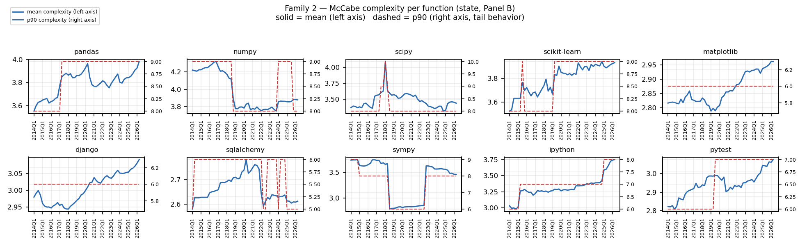

Mean McCabe complexity per function grew a fixed-effects-pooled **+4.7%**
(3.26 → 3.42) — the smallest movement of any of the four families, and it
is not a smooth trend so much as several *repo-specific* step changes
(visible as literal steps in the p90 line, since p90 of a small integer
distribution quantizes): pandas steps up around 2017, numpy steps *down*
around 2018&ndash;2019, scikit-learn steps up twice (2015, 2019). sympy's
swings are the largest in the sample and are a composition artifact, not a
complexity story — see the Event study section.

## Family 3 — function length

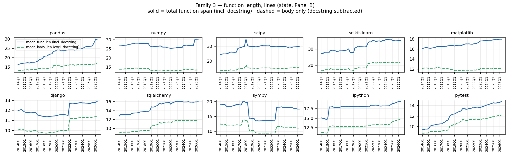

This is the headline check from the brief, and it replicates **across the
whole panel, not just pandas**: `mean_func_len` (total span, includes the
docstring) rose a pooled **+25.0%** (17.9 → 22.4 lines) while
`mean_body_len` (docstring subtracted) rose only **+17.0%** (12.1 → 14.1
lines). In every one of the 10 small multiples the solid (total) line
visibly separates from the dashed (body) line over time — functions are
getting longer, but a real share of that growth is documentation, and
reporting only `mean_func_len` overstates how much the *executable* body
of a typical function has grown by roughly a third of the apparent effect,
consistently across the sample.

sympy is excluded from the "smooth trend" characterization here — its two
sharp discontinuities (2018Q3, 2022Q4) are a distinct phenomenon, addressed
under Event study.

## Family 4 — size of added parts

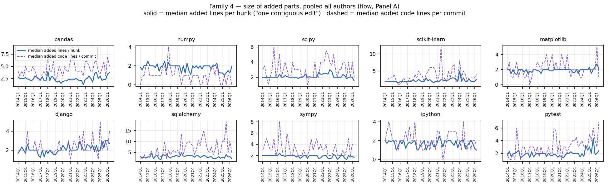

The cleanest result in the whole study. **Median added lines per hunk —
the size of one contiguous, atomic edit — is essentially flat across all
10 repos and all 12 years**: pooled fixed-effects change is **+4.3%**
(2.09 → 2.18 lines), noise-level. Meanwhile **median added code lines per
commit rose +43.5%** (2.3 → 3.3 lines) over the same window. Read together:
the growth is not in how big a single edit is — people still touch a
couple of lines at a time — it's in how many hunks/files a typical commit
now bundles together. "Commits got bigger" and "edits got bigger" are
different claims, and this panel only supports the first one.

---

## Pooled series with repo fixed effects

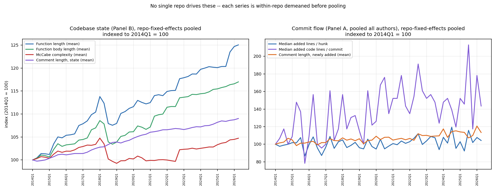

Each line is within-repo demeaned before averaging, then re-centered on
the panel's grand mean and indexed to its own 2014Q1 value — so a single
large project (pandas, with 4&times; sympy's function count) can't just
outweigh the others by sitting at a higher absolute level. The ranking
holds even after that correction: function length moved the most, then
body length, then state comment length, then complexity (left panel); on
the flow side (right), added-code-lines-per-commit is both the biggest
mover and by far the noisiest, comment-flow is a distant second, and
hunk size is flat (right panel) — same conclusions as the per-family
charts, confirming they aren't an artifact of one or two large repos.

## Event study

Four candidate break dates were tested against a null of "no discrete
shift": 2018Q1 (roughly when several of these projects began simplifying
away Python-2 support), 2020Q1 (COVID-era shift to remote work), 2022Q4
(ChatGPT's public release, Nov 30 2022 — the natural candidate given this
project's broader AI-adoption research context), and 2023Q1.

**Naive pre/post mean comparison is misleading here.** At *every* candidate
date, function length, body length, and comment length show up as "9 or 10
of 10 repos moved in the same direction" — which looks exactly like the
break signature the brief warned to look for, except it shows up
identically at 2018Q1 as at 2022Q4. That's the signature of a persistent
multi-year growth trend, not a break at any particular point: any split of
a monotonically rising series looks like "everyone moved up after X."

**The actual test:** fit each repo's own linear trend on the quarters
*before* the candidate date, extrapolate it forward, and check whether the
real values land on that line or jump away from it. Deviation-from-own-trend
plots for all four state metrics:

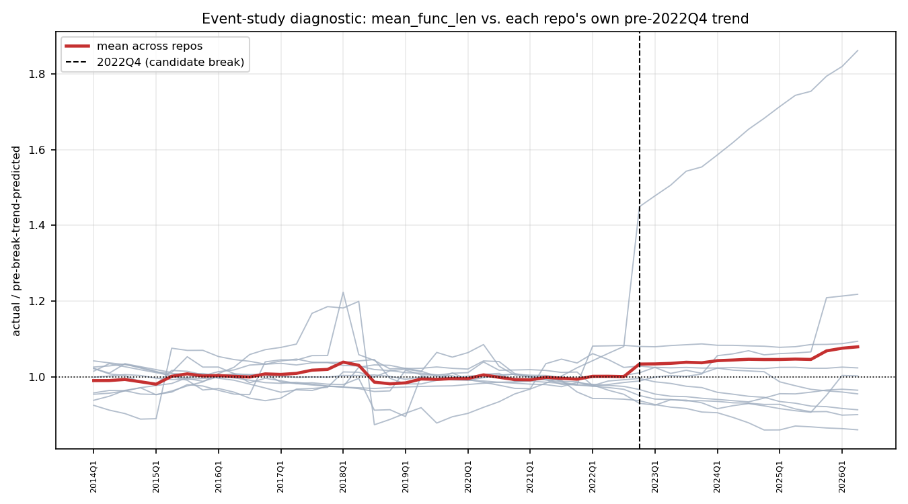
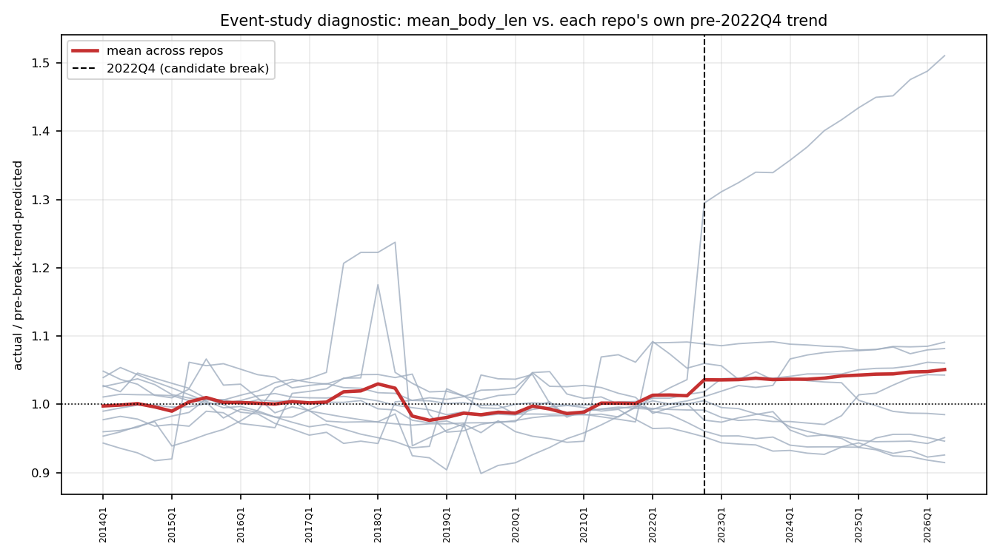
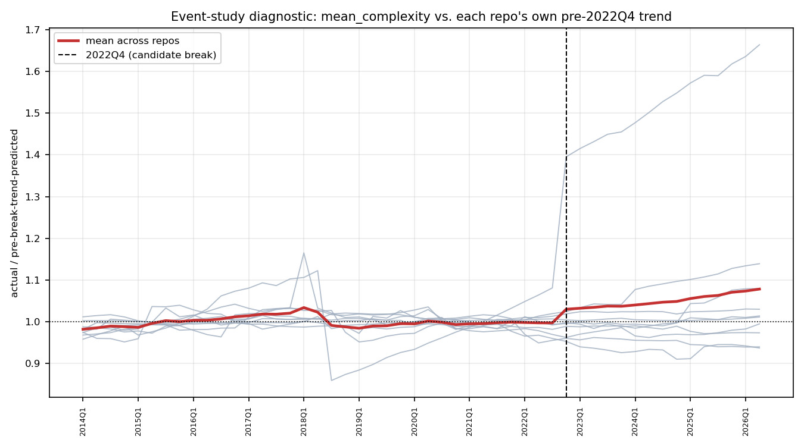
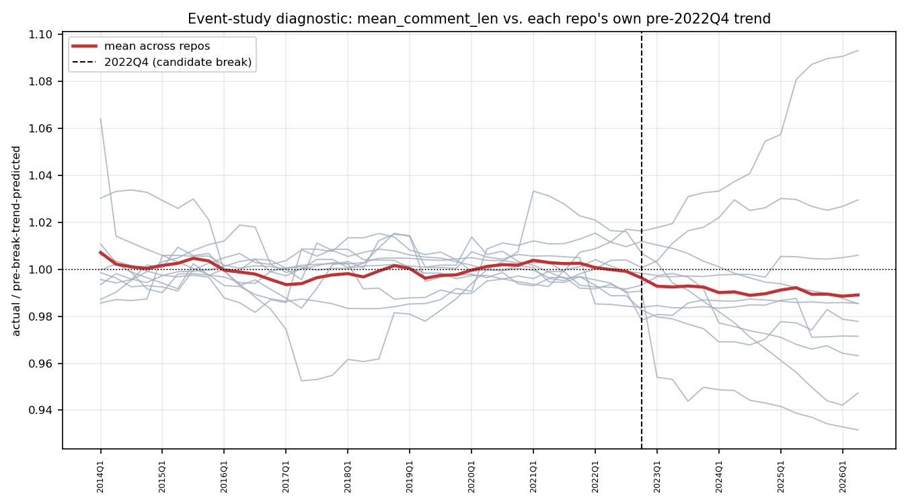

Once each repo is compared to its own pre-existing trend rather than a
flat pre-period average, the mean-across-repos line (red) sits within a
few percent of 1.0 throughout — no sustained, panel-wide jump at 2022Q4 or
any other candidate date. **Conclusion: no evidence of a discrete,
panel-wide structural break in comment length, complexity, function
length, or added-part size at any tested date, including the ChatGPT
release.** This is a real negative result, not an absence of looking — it
doesn't rule out effects too small, too gradual, or too concentrated in
specific authors/files for a whole-codebase quarterly aggregate to surface
(that question needs the AI-detector pipeline elsewhere in this project,
which operates at function granularity, not the corpus-wide average used
here).

**What the gray lines in those plots *do* show is a single-repo artifact
worth naming explicitly, because it's exactly the failure mode this
exercise is designed to catch.** sympy is the visible outlier fanning away
from 1.0 in all three of function length (1.86&times; trend by 2026Q2),
body length (1.51&times;), and complexity (1.66&times;) — every other repo
stays within roughly &plusmn;20%. Looking at sympy's raw `n_functions`
column explains it without any complexity story: `n_functions` jumps from
16,071 to 25,579 between 2018Q2 and 2018Q3 (mean length instantly drops
19.7&rarr;14.2 as thousands of short functions enter the population), then
*drops* from 29,792 to 19,810 between 2022Q3 and 2022Q4 (mean length jumps
back up 13.7&rarr;18.1 as that population leaves). `n_files` barely moves
either time (813&rarr;783 in the second case). A large module was added
around mid-2018 and something comparable was removed or relocated around
Q4 2022 — a codebase composition change, not a shift in how anyone writes
functions. numpy shows a smaller, same-direction echo (1.22&times; on
function length) worth a similar sanity check before trusting it. **This
is why Panel B carries `n_files`/`parsed_files`/`n_functions` alongside
every aggregate: without them this would have been reported as "sympy's
code got 86% more complex," which is false.**

## Author-controlled decomposition

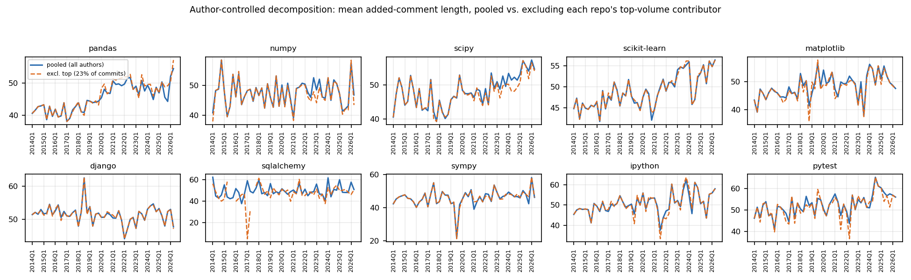
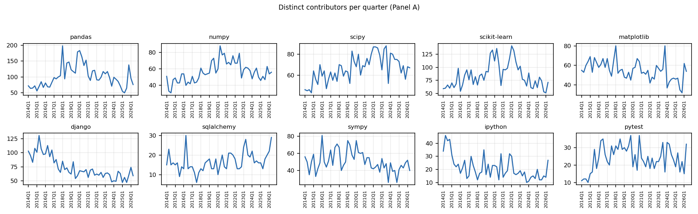

Top-volume contributor per repo, share of that repo's commits in the full
2014&ndash;2026 window:

| repo | top contributor | share |
|---|---|---:|
| sqlalchemy | Mike Bayer | 70.9% |
| pandas | jbrockmendel | 23.3% |
| matplotlib | Antony Lee | 17.0% |
| pytest | Bruno Oliveira | 17.7% |
| ipython | Matthias Bussonnier | 15.8% |
| django | Tim Graham | 13.2% |
| scipy | Matt Haberland | 11.0% |
| numpy | Sebastian Berg | 8.6% |
| sympy | Oscar Benjamin | 6.3% |
| scikit-learn | Guillaume Lemaitre | 4.2% |

Every quarterly series in `output/analysis/panel_a_quarterly.csv` carries
both a `pooled_*` and an `excltop_*` column, plus `pooled_n_contributors` /
`excltop_n_contributors`, so any of the flow metrics can be rebuilt with or
without the dominant contributor without touching raw data.

Two concrete cases where this matters:

- **sqlalchemy is a reliability warning, not just a decomposition.** Mike
  Bayer made 70.9% of all commits in-window, and in several quarters
  (2017Q3: 95 pooled commits, 5 left after excluding him) the "excluding
  top contributor" series is an estimate over a handful of commits — the
  wide swings in its dashed line in the small multiples above are sampling
  noise, not signal. Any read of sqlalchemy's excl-top series should carry
  the quarter's `excltop_n_commits` alongside it.
- **pandas 2026 reproduces the exact pitfall the brief described.** In
  2026Q2, jbrockmendel made 342 of 496 commits (69%) touching in-scope
  files; pooled mean added-comment-length that quarter is 54.6 chars,
  excluding him it's 57.3 — a real difference driven by one contributor's
  commenting style dominating the pooled number for that specific quarter.
  Across the full window his share is a more moderate 23.3%, so this is a
  quarter-level effect, not a repo-level one — another reason the pooled
  number alone isn't enough.

Distinct-contributor counts per quarter range from single digits
(sqlalchemy, pytest, ipython in early quarters) up to ~200 (pandas at
peak) — see `contributor_counts.png` and the `pooled_n_contributors`
column for the full per-repo-quarter series.

---

## What's robust vs. what isn't

**Robust across the panel** (holds in 9&ndash;10 of 10 repos, survives the
trend-correction check, not driven by one repo's absolute size):
- function length grows faster than body length everywhere (Family 3
  headline finding)
- median hunk size is flat everywhere (Family 4 headline finding)
- comment length drifts up gradually in both panels, everywhere
- no discrete break at any of the four tested candidate dates, in any of
  the four families

**Single-repo or quarter-level artifacts — do not generalize:**
- sympy's complexity/length swings at 2018Q3 and 2022Q4 (composition
  effect from a module addition/removal, confirmed via `n_functions`)
- sqlalchemy's excl-top series in low-commit quarters (small-N noise, not
  a real behavioral difference)
- pandas's 2026Q2 comment-length gap between pooled and excl-top (one
  contributor's temporary dominance that quarter, not a repo-wide shift)

**Noisiest / least conclusive:**
- Panel A's `median_added_code_lines_per_commit` — real upward drift
  (+43.5% pooled) but with the highest quarter-to-quarter variance of any
  series in this study; treat individual-quarter values as unreliable and
  read the trend, not the level.

---

## How this compares to the published literature

Lehman's laws of software evolution predict continual growth in size and
complexity for actively-maintained systems, and this panel's mature-repo
tracking is broadly consistent with that — though the empirical literature
is more divided on *why* and *how much* than a flat "complexity always
rises" reading suggests. Alenezi's study of five open-source systems found
complexity growth over ten releases conforms to Lehman's second law [1];
Neamtiu et al.'s study spanning 653 releases across seven projects and 69
combined years of evolution similarly confirmed several of Lehman's laws
while finding others depend heavily on how they're operationally defined
[2] — a caution this report's own event-study section (where a naive break
signal dissolved under proper trend-correction) independently illustrates.
Godfrey and Tenant's Linux kernel case study found growth so strong it was
*super-linear* — accelerating, not merely continuing [3] — a more dramatic
pattern than this panel's own modest, multi-year drifts (function length
+25%, complexity +4.7% over 12 years), suggesting the 10 repos tracked
here sit toward the calmer end of what's been observed, not an outlier in
the other direction.

Yan et al.'s cross-community study of Apache, Google, and Spring
projects — explicitly framed around metrics "relevant for evaluating
AI-generated code" — found complexity and lines-of-code-per-function both
rise as projects mature, attributed mainly to feature growth and
fault-tolerance logic, and found that continuous refactoring by key
contributors can curb the rise [4]. That refactoring-as-counterweight
mechanism isn't tested directly here but is consistent with the
sqlalchemy/pandas author-concentration cases already discussed: a small
number of dominant contributors shape a repo's trajectory disproportionately,
for better or worse.

On comments specifically: Fluri et al.'s co-evolution study of eight
systems found that the *relative amount* of comments and code grows at
about the same rate [5] — a finding about comment *volume* tracking code
volume, not about comment *length* per comment, which is what this report
measures and finds essentially flat across 12 years. The two are
compatible, not contradictory: more code could bring proportionally more
comments (Fluri et al.'s finding) while each individual comment stays
about the same length (this report's finding) — together they'd suggest
people write more comments as code grows, without writing longer ones.
Ebiwonjumi et al.'s study of documentation-commit patterns before
(2018–2021) and after (2022–2025) the rise of AI coding tools — run on six
repositories including pandas, one of this panel's own ten — found an
8.3% *decrease* in documentation-focused commits alongside a 53.4%
increase in commit message detail across that boundary [6]. This report's
own event-study explicitly tested for a break at the ChatGPT release date
across all ten repos and found none that survived correcting for each
repo's pre-existing trend; Ebiwonjumi et al.'s finding — measured
differently (commit classification, not a trend-corrected panel
regression) and on a narrower repo set — is a useful point of tension
rather than confirmation. "No discrete break survives a rigorous test"
and "no effect exists" are different claims, and a more targeted
commit-classification approach might surface an effect this panel's
whole-codebase quarterly aggregates smooth over.

### References

[1] [Empirical Analysis of the Complexity Evolution in Open-Source Software Systems](https://consensus.app/papers/details/41c8f7d8b3c553519acc63405144ff2c/?utm_source=claude_desktop) (Alenezi et al., 2015, *International Journal of Hybrid Information Technology*)

[2] [Towards a better understanding of software evolution: An empirical study on open source software](https://consensus.app/papers/details/694e613b3435554aa076bc825fa76df2/?utm_source=claude_desktop) (Neamtiu et al., 2009, ICSM)

[3] [Evolution in open source software: a case study](https://consensus.app/papers/details/ab652abf262259f4ac052d932af544a3/?utm_source=claude_desktop) (Godfrey & Tenant, 2000, ICSM)

[4] [Evolving Trends in Cleanliness of Open Source Projects](https://consensus.app/papers/details/0c06a6ea820453ea80d3b6847bc2105f/?utm_source=claude_desktop) (Yan et al., 2026, *ACM Transactions on Software Engineering and Methodology*)

[5] [Analyzing the co-evolution of comments and source code](https://consensus.app/papers/details/848a3e9bf61e536cb67c68eac26e4b26/?utm_source=claude_desktop) (Fluri et al., 2009, *Software Quality Journal*)

[6] [Do Generative AI Tools Change How Developers Comment and Document Code?](https://consensus.app/papers/details/db7639c7ef7a5ebba8067c6f4e652450/?utm_source=claude_desktop) (Ebiwonjumi et al., 2026, ICAIIC)

---

## Data & reproducing this

- Raw per-commit rows: `output/<repo>_panel_a.csv`
- Quarterly codebase-state snapshots: `output/<repo>_panel_b.csv`
- Extraction provenance (HEAD SHA, dates, clone size/time): `output/<repo>_meta.json`
- Quarterly rollups (pooled + excl-top-contributor + contributor counts):
  `output/analysis/panel_a_quarterly.csv`
- Top-contributor table: `output/analysis/top_contributors.csv`
- Event-study residual series: `output/analysis/event_study_*.csv`
- Regenerate everything: `python3 src/analysis.py && python3 src/charts.py`
  (re-running `src/driver.py` first is a no-op unless `src/config.py` changes)
