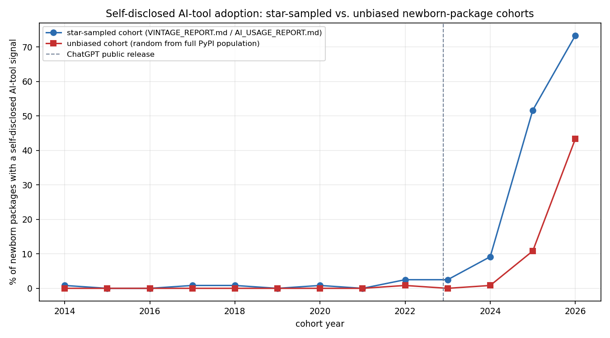
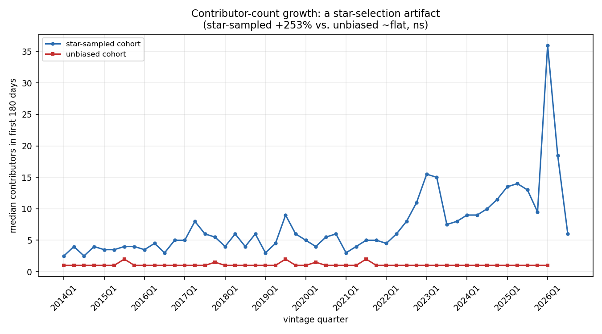

# Does removing the GitHub-star sampling bias change any conclusion?

**Short answer: partly.** The core structural-evolution story in
[VINTAGE_REPORT.md](VINTAGE_REPORT.md) replicates in direction once the
star-popularity sampling bias is removed — functions, bodies, and
comments really do get longer and more complex over calendar time, in a
uniformly-random sample of the true PyPI population, not just in a
sample of repos that happened to attract GitHub stars. But two things
that looked like real trends in the star-sampled data turn out to be
**artifacts of the sampling method, not the underlying population**: the
headline AI-tool-adoption rate from
[AI_USAGE_REPORT.md](AI_USAGE_REPORT.md) was substantially inflated
(2025: 51.7% star-sampled vs. 10.8% unbiased), and the apparent
contributor-count growth trend (+253%) vanishes entirely in the unbiased
data (~flat, not significant).

This report is the concrete follow-through on the "genuine next step"
[AI_DEPENDENCY_NETWORK_REPORT.md](AI_DEPENDENCY_NETWORK_REPORT.md) named
but didn't attempt: using the full population of newborn PyPI packages
— not a GitHub-star-ranked sample of them — as the base for this
project's existing extraction pipeline.

## Method

A second, parallel vintage cohort, same target size as the original
(30 packages/quarter), same clone → measure → rm -rf extraction
machinery, same AI-signal scan — but discovered differently:

- **Original cohort** ([VINTAGE_REPORT.md](VINTAGE_REPORT.md)): GitHub
  code-search API, sorted by stars, `language:Python fork:false
  created:<quarter range>`. Vintage quarter = quarter of the repo's
  first git commit (the best signal GitHub-only discovery had available).
- **This cohort**: a uniform random sample from
  [`cl_ecosystem_networks`](AI_DEPENDENCY_NETWORK_REPORT.md#connection-to-cl_ecosystem_networks)'s
  full bulk PyPI package population (`packages.parquet`, ~783K PyPI
  packages), restricted to active packages (`status IS NULL`) with a
  parseable `github.com/owner/repo` URL, stratified by **first PyPI
  release** quarter — no ranking, no popularity signal used anywhere in
  the sampling. Vintage quarter and the 180-day snapshot anchor are both
  keyed to first PyPI release instead of first git commit; see
  `vintage_extract_unbiased.py`'s module docstring for the full
  reasoning (release is arguably the cleaner "birth" event for a
  *published package* specifically, vs. first commit being what
  GitHub-only discovery had to use as a proxy).

1,470 packages extracted across 49 quarters (2014Q1–2026Q1; 2026Q2/Q3
have zero PyPI candidates in the source data snapshot — a data-horizon
limit of when that dump was taken, not a bug). Every target quarter hit
its full 30/quarter, no shortfalls. Discovery itself is a single local
DuckDB query against the parquet file — no GitHub API, no rate limits —
though it surfaced a DuckDB 1.5.1 query-plan bug along the way
(chaining a 51-branch `CASE` → window function → outer `SELECT` as
nested CTEs either segfaulted on `ORDER BY` or silently returned values
from the wrong column; fixed by materializing the intermediate result
into a real temp table first).

**A confound specific to this discovery source had to be caught and
filtered before the real run**, found during a one-quarter validation
pass: sampling by "first PyPI release in quarter X" surfaces
sub-packages of already-mature monorepos as if they were newborn
packages. `open-telemetry/opentelemetry-python` and
`autoresearch/autora` both slipped through initially — their sampled
sub-package's first release was recent, but the underlying shared git
history was 4–7.5 years old (gaps of 1,473 and 2,726 days between first
commit and that release). Measuring "180 days after this release" on
either would have silently scored a mature, many-contributor monorepo as
a newborn small package. Fixed with an asymmetric sanity check: reject
if the repo's first commit is more than 730 days before the sampled
release (empirically set — the other 8 packages in that validation batch
all had gaps of 0–407 days, the normal range for solo/small-team private
development before a first release) or after it at all (impossible under
honest data, and a sign the `repository_url` doesn't actually match this
package). 208 candidates were rejected on this basis in the full run.

## Result 1: the AI-adoption headline number was substantially inflated

| year | star-sampled | unbiased | gap |
|---|---:|---:|---:|
| 2022 | 2.5% | 0.8% | −1.7pp |
| 2023 | 2.5% | 0.0% | −2.5pp |
| 2024 | 9.2% | 0.8% | −8.3pp |
| 2025 | 51.7% | 10.8% | −40.8pp |
| 2026 | 73.3% | 43.3%* | −30.0pp |

\* 2026 unbiased is 2026Q1 only (30 packages) vs. all three quarters
(90 packages) for star-sampled — see caveats.

The *shape* replicates: both cohorts show near-zero self-disclosed
AI-tool usage before 2022 and a rise starting around ChatGPT's release,
consistent with the mechanism (not just the magnitude) being real. But
the star-sampled cohort's 2025 headline number is roughly **4.8× the
unbiased cohort's**. GitHub-star-ranked discovery plausibly selects for
exactly the packages most likely to both use *and disclose* AI tooling:
high-visibility projects care more about onboarding/contributor
documentation (hence more `CLAUDE.md`/`.cursorrules` files), and a
meaningful fraction of what gets stars quickly right now *is* AI-agent
tooling built by AI-tool-using developers. **AI_USAGE_REPORT.md's
adoption-rate numbers should be read as this project's star-sampled
population's rate, not the true PyPI-wide rate** — the true rate, on
this evidence, is meaningfully lower.

## Result 2: the structural-evolution story mostly replicates

| metric | star-sampled trend | unbiased trend | same direction? | cross-cohort quarterly correlation |
|---|---:|---:|:---:|---:|
| mean function length | +103%, ρ=0.91*** | +49%, ρ=0.81*** | yes | ρ=0.74*** |
| mean function body length | +120%, ρ=0.95*** | +60%, ρ=0.80*** | yes | ρ=0.73*** |
| mean cyclomatic complexity | +69%, ρ=0.85*** | +42%, ρ=0.69*** | yes | ρ=0.62*** |
| mean docstring length | +94%, ρ=0.53*** | +96%, ρ=0.40** | yes | ρ=0.41** |
| frac. functions with docstring | +60%, ρ=0.28* | +109%, ρ=0.48*** | yes | ρ=0.33* |
| median hunk size (added lines) | +82%, ρ=0.28* | +73%, ρ=0.74*** | yes | ρ=0.17, ns |
| median added lines/commit | +212%, ρ=0.60*** | +239%, ρ=0.82*** | yes | ρ=0.48*** |

(`*` p<0.05, `**` p<0.01, `***` p<0.001; ns = not significant. Full
table with all 13 metrics: `output/cohort_comparison/vintage_trend_comparison.csv`.)

Every metric in this table moves the **same direction** in both
cohorts, and five of seven show a significant positive correlation
between the two cohorts' own quarter-by-quarter medians — i.e. not just
"both trend up," but they wiggle together, the signature of a real
shared calendar-time effect rather than two independent noisy series
that happen to share a sign. Magnitudes are consistently **smaller** in
the unbiased cohort (roughly half, in most cases) — star-sampled repos
apparently drift toward longer/more-complex/better-documented code
*faster* than the population average, but the underlying direction the
whole codebase-evolution finding rests on is not a sampling artifact.

## Result 3: contributor-count growth *is* a sampling artifact

This is the cleanest artifact found. Star-sampled cohort:
`flow_n_contributors` up **+253%** over the study period, ρ=0.79,
p=6×10⁻¹². Unbiased cohort: **~flat**, ρ=−0.11, p=0.47 (not
significant), cross-cohort correlation ρ=−0.07 (essentially zero — the
two series don't even move together). The unbiased cohort's median sits
at exactly 1 contributor in nearly every quarter across the entire
2014–2026 span: the typical outcome for a uniformly-random newborn PyPI
package, in every era studied, is a solo project. Star-ranked discovery
selects directly on the outcome this metric measures — a repo has to be
popular enough to be found by a stars-sorted search, and popularity
correlates strongly with attracting contributors — so the star-sampled
"trend" is largely measuring how the study's own discovery method
increasingly favors multi-contributor projects in eras where that
selection is easier (more repos to choose from, more AI-tooling repos
going viral fast), not a population-wide shift in how newborn packages
get built. `flow_n_commits` (+19% star vs. −19% unbiased) and comment
length metrics show the same weaker sign-flip pattern, plausibly related
for the same reason (more contributors → more commits).

## Caveats

- **The vintage-anchor change (PyPI release vs. first git commit) is a
  genuine methodology difference, not a pure isolation of sampling
  bias.** Some of the magnitude gap between cohorts could reflect that
  difference rather than sampling alone — this design can't fully
  separate the two. A tighter follow-up would re-anchor one cohort to
  match the other's definition exactly.
- **2026 is asymmetric between cohorts**: unbiased has only 2026Q1 (30
  packages; the source parquet snapshot has no PyPI releases recorded
  for 2026Q2/Q3), star-sampled has all three 2026 quarters (90
  packages). The 2026 comparison row should be read as noisier and less
  settled than the rest.
- **Self-disclosed AI usage remains a floor, not an estimate, in both
  cohorts** — see AI_USAGE_REPORT.md's full caveat. What this report
  adds is evidence about *relative* inflation from star-sampling, not a
  new absolute estimate of true adoption; the unbiased cohort's lower
  numbers could still undercount true usage by a similar (or different)
  margin.
- **Not attempted here**: re-running the dependency-popularity
  case-control study (DEPENDENCY_REPORT.md) or the AI-dependency-network
  comparison (AI_DEPENDENCY_NETWORK_REPORT.md) on this cohort. Both need
  an additional `deps_extract.py` + `deps_popularity.py` pass
  (per-dependency ecosyste.ms lookups) — a separately-scoped,
  separately-expensive step, not part of this run.
- One package (`kokhou/jwtools`) crashed the first extraction attempt on
  an empty-repo edge case (`git rev-parse HEAD` on a repo with no
  commits, unhandled); fixed and the run resumed cleanly from progress
  state. Trivial impact (1 candidate rejected, replaced from the
  oversample buffer) but noted for completeness.

## Data & reproducing this

- Discovery: `python3 src/vintage_discover_unbiased.py` →
  `output/vintage_unbiased/candidates.json`
- Extraction: `python3 src/vintage_extract_unbiased.py` →
  `output/vintage_unbiased/packages.csv` (resumable via
  `output/vintage_unbiased/progress.json`)
- AI-signal scan: `python3 src/ai_signal_extract_unbiased.py` →
  `output/ai_signal_unbiased/ai_signals.csv`
- Comparison: `python3 src/cohort_comparison.py && python3
  src/cohort_comparison_charts.py` →
  `output/cohort_comparison/*.csv`, `output/cohort_comparison/charts/*.png`
