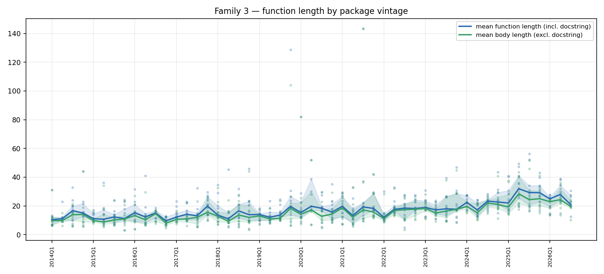
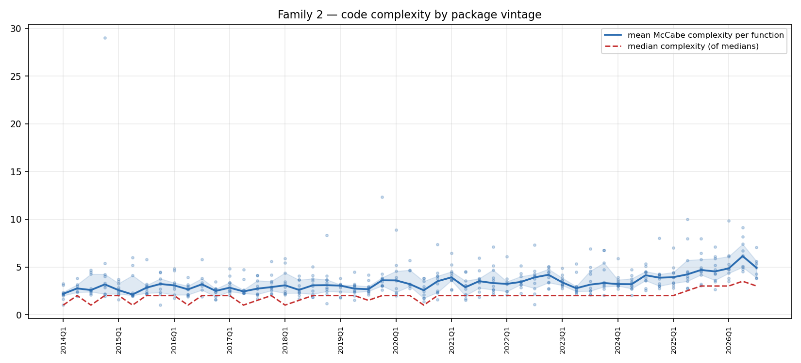
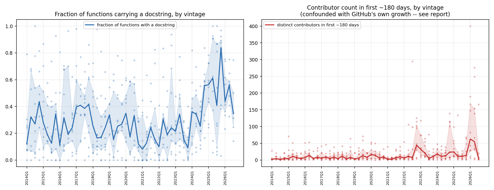
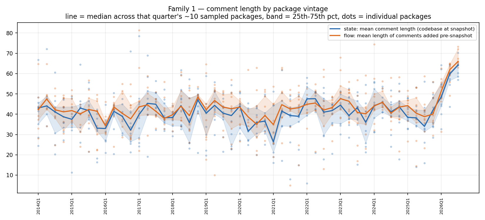
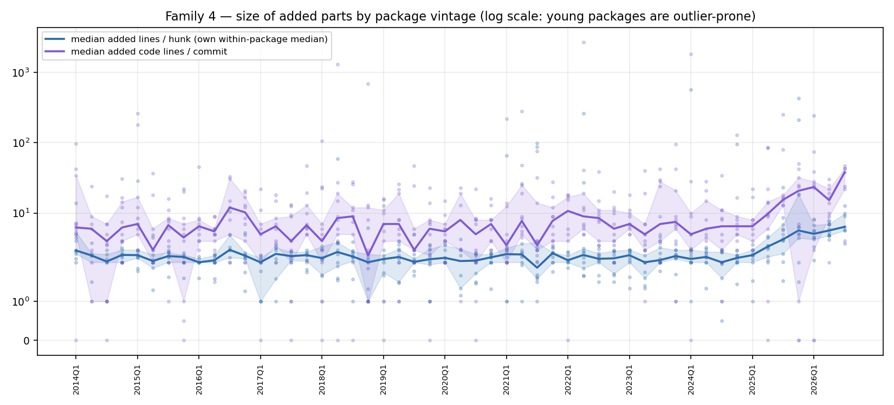
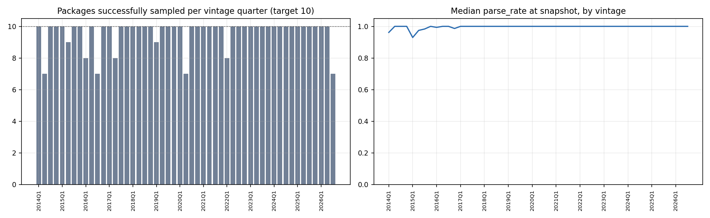

# Do newly-created packages look different depending on when they were born?

The [main study](REPORT.md) tracks the same 10 mature projects across 12
calendar years. This one asks a different question: pick ~10 new Python
packages born in each quarter since 2014, measure each one's structure at
the same point in its own lifecycle (~180 days after its first commit),
and see whether the *starting* shape of a newly-created package has
changed across 51 birth-cohorts. Methodology, the discovery/validation
pipeline, and every caveat are in [README.md](README.md#vintage-cohort-study-separate-from-the-above);
this document is the findings.

**Sample:** 490 packages across 51 quarters (2014Q1–2026Q3), 9.6/quarter on
average, from 978 GitHub candidates scanned (358 rejected for not actually
being a package — no `setup.py`/`pyproject.toml`/`setup.cfg` — and 78 more
for having a birth-quarter that didn't match their real git history; see
README for both).

**This is a fundamentally noisier, more confounded dataset than the main
study**, and the two shouldn't be read with equal confidence: 7–10
packages per point instead of a fixed panel of 10 tracked for 12 years
each, selected by a popularity signal (GitHub stars) whose baseline
shifted enormously as GitHub itself grew across the same window. Every
finding below is stated with that caveat attached, not as a footnote at
the end.

---

## Headline: newly-created packages start out much bigger and more complex now than in 2014–2015

Comparing the median of the first 8 cohort-quarters (2014Q1–2015Q4) to the
median of the last 8 (2024Q4–2026Q2):

| metric | 2014–2015 cohorts | 2024–2026 cohorts | change |
|---|---:|---:|---:|
| mean function length (lines) | 11.1 | 26.4 | **+137%** |
| mean function body length (excl. docstring) | 10.0 | 23.6 | **+136%** |
| mean McCabe complexity | 2.67 | 4.61 | **+73%** |
| median McCabe complexity | 2.0 | 3.0 | +50% |
| fraction of functions with a docstring | 27% | 56% | **+103%** |
| mean comment length (chars) | 41.5 | 42.8 | +3% |

The magnitude here dwarfs the equivalent numbers from the calendar-time
study, where the *same 10 mature repos*, tracked over the *same 12 years*,
showed function length +25%, body length +17%, complexity +4.7%. Put the
two side by side and a pattern emerges: **existing, mature projects have
drifted only modestly toward longer/more-complex functions, but the
population of newly-started packages has shifted much more sharply.**
Whatever is driving code to get bigger and more elaborate over the last
decade shows up far more in what a package looks like *when it's founded*
than in how an established codebase evolves.

## Docstring rate: flat for a decade, then a sharp acceleration in 2024–2025

The fraction of functions carrying a docstring bounces noisily between
roughly 0.10 and 0.40 for every cohort from 2014Q1 through 2024Q3 — no
trend, just quarter-to-quarter sampling noise from a 10-package cohort.
Then: 2024Q4 = 0.56, 2025Q1 = 0.56, 2025Q2 = 0.61, 2025Q4 = 0.84 (the
single highest point in the whole series), before settling back to
0.35–0.56 in the first three quarters of 2026. That's a distinct
step, not a continuation of the prior noise band, and it lands squarely
in the window where AI coding assistants (GitHub Copilot, ChatGPT-based
tools) went from novelty to mainstream. **This is consistent with — but
does not prove — AI-assisted authorship of new packages**: these tools
are well known to default to generating docstrings liberally. Confirming
that would need the function-level AI-detector elsewhere in this project,
not a corpus-wide aggregate like this one. Two things temper the
enthusiasm for that reading: this is exactly the highest-star, most
recent, most confound-prone slice of the sample (see below), and the
2026 figures already show it pulling back rather than continuing to
climb.

## Comment length: the one thing that doesn't move, again

Both state comment length (42.8 vs 41.5) and flow-added comment length
(+4.5%) are essentially flat across the entire 12-year vintage span — the
same finding as Family 1 in the calendar-time study, now confirmed on an
entirely different, non-overlapping sample of packages. Whatever people
write in a `#` comment has stayed about the same length since 2014,
regardless of whether you look at a fixed set of mature projects over
time or a fresh sample of newly-founded ones by birth year. That
consistency across two independently-built datasets is itself the
strongest single piece of evidence in this whole exercise.

## Size of added parts: noisy, but a real late uptick

Log-scaled because individual packages are wildly outlier-prone here — a
180-day-old package can easily have had only a dozen commits, so one bulk
scaffold/vendoring commit dominates its own median. Reading the median
line (not the scattered dots): added-lines-per-hunk sits in a tight 2.5–4
band from 2014 through roughly 2023, then climbs to 5–7 across
2024–2026. Added-lines-per-commit is noisier throughout (typically 4–10,
occasional spikes) with a similar late-window rise. Unlike the
calendar-time study — where hunk size for *mature* repos was essentially
perfectly flat over 12 years — new packages' initial commits do appear to
be getting chunkier recently. Given the small-N noise here, treat this as
directional, not precise.

## What NOT to read into this data

**Contributor count and commit count in the first 180 days are the
weakest signals in this study and are presented for completeness, not as
a finding.** Median contributors-in-first-180-days went from 4 (2014–2015
cohorts) to 18.75 (2024–2026 cohorts), a +369% change — but this sample
selects the *most-starred* packages born each quarter, and GitHub's own
user base grew roughly 20-fold across this window. A "top-10-by-stars"
package born in 2025 is being drawn from an audience of ~100M+ developers;
one born in 2014 was drawn from ~4M. Faster star accumulation mechanically
implies faster visibility, which mechanically implies more contributors
showing up sooner — independent of anything about how the code itself is
written. Several 2025–2026 candidates in the raw discovery data show star
counts hard to justify for their age at all (see README), consistent with
the well-documented recent wave of star-inflation on speculative
AI-tooling repos. **The code-shape metrics above (function length,
complexity, docstring rate) are one step removed from this confound —
they're properties of the code, not of its audience — but they aren't
fully insulated from it either**: a more-visible package attracts more
total engineering effort per unit time, which could independently push
functions to grow faster regardless of *how* people are writing them.
Nothing in this dataset can fully separate "packages are written
differently now" from "popular new packages get more attention faster
now, and more attention means more code, faster." Both are probably true
to some degree; this study cannot apportion the split.

---

## Sample health

9 of 51 quarters landed short of the 10-package target (7–9 found instead)
after exhausting all 25 discovered candidates — mostly quarters with an
unusually high share of non-package results (awesome-lists, tutorial
repos) among the top-25 by stars. `state_parse_rate` starts a little
below 1.0 in 2014–2015 (median ~0.83–0.95 in the earliest cohorts, versus
1.00 from 2017 onward) — the same Python-2-tail effect as the
calendar-time study, just measured on freshly-founded-in-2014 packages
rather than on old files still living inside a 2026 mature codebase.

## Data & reproducing this

- Discovered candidates (25/quarter, before package validation):
  `output/vintage/candidates.json`
- One row per successfully-measured package: `output/vintage/packages.csv`
- Per-repo/candidate outcome log (why each of the 978 scanned candidates
  succeeded or was rejected): `output/vintage/progress.json`
- Cohort-quarter aggregates (median/mean/p25/p75 across each quarter's
  packages): `output/vintage/analysis/vintage_quarterly.csv`
- Headline early-vs-late trend table: `output/vintage/analysis/vintage_trend_summary.csv`
- Regenerate: `python3 src/vintage_discover.py && python3 src/vintage_extract.py
  && python3 src/vintage_analysis.py && python3 src/vintage_charts.py`
  (each stage is resumable; re-running a finished stage is a no-op)
